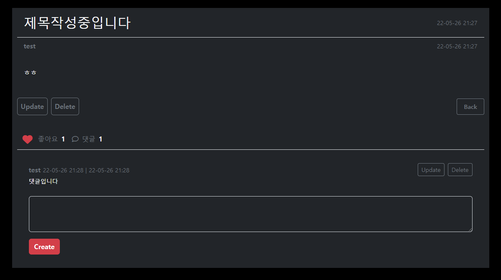

# D-FLEX

영화 검색, 조회, 추천 사이트

커뮤니티 기능


# 1. 팀원 정보 및 업무 분담 내역

### `팀장` 임진현 ..

- Back-End
- Python
- Django
- Kakao OAuth

### `팀원` 함희주

- Frond-End
- HTML
- CSS
- JavaScript
- BootStrap 5


# 2. URL, 함수, 기능


## 2 - 1. URLs

|           | URL                                            | View            |
| :-------- | ---------------------------------------------- | --------------- |
|           |                                                |                 |
| /         | /                                              | home            |
|           | search/                                        | search          |
| accounts/ |                                                |                 |
|           | signup/                                        | signup          |
|           | login/                                         | login           |
|           | logout/                                        | logout          |
|           | profile/`<username>`/                          | profile         |
|           | update/                                        | update          |
|           | password/                                      | change_password |
|           | kakao_login/                                   | kakao_login     |
|           | kakao_unlink/                                  | kakao_unlink    |
|           | auth/                                          | auth            |
| articles/ | /                                              | articles        |
|           | create/                                        | article_create  |
|           | `<article_pk>`/                                | article_detail  |
|           | `<article_pk>`/update/                         | article_update  |
|           | `<article_pk>`/delete/                         | article_detail  |
|           | `<article_pk>`/like/                           | article_like    |
|           | `<article_pk>`/comments/create/                | comment_create  |
|           | `<article_pk>`/comments/`<comment_pk>`/update/ | comment_update  |
|           | `<article_pk>`/comments/`<comment_pk>`/delete/ | comment_delete  |
| movies/   | /                                              | movies          |
|           | `<movie_pk>`/                                  | movie_detail    |
|           | `<movie_pk>`/reviews/create/                   | review_create   |
|           | `<movie_pk>`/reviews/`<review_pk>`/update/     | review_update   |
|           | `<movie_pk>`/reviews/`<review_pk>`/delete/     | review_delete   |
|           | for-you/`<movie_pk>`/                          | for_you         |
|           | for-you2/`<movie_pk>`/                         | for_you2        |
|           | for-you3/`<movie_pk>`/                         | for_you3        |


## 2 - 2. Views

|          | 이름            | 역할                                        |
| -------- | --------------- | ------------------------------------------- |
| home     | home            | 홈 페이지 렌더링                            |
|          | searching       | 데이터 탐색, 탐색 페이지 렌더링             |
| accounts | signup          | 회원 가입 폼 렌더링, 회원 가입              |
|          | login           | 로그인 폼 렌더링, 로그인                    |
|          | logout          | 로그아웃                                    |
|          | profile         | 유저 프로필 렌더링                          |
|          | update          | 유저 정보 변경 폼 렌더링, 유저 정보 변경    |
|          | change_password | 비밀번호 변경 폼 렌더링, 비밀번호 변경      |
|          | kakao_login     | 카카오 로그인 진행                          |
|          | kakao_unlink    | 카카오 정보 삭제 진행                       |
|          | oauth           |                                             |
| articles | articles        | 커뮤니티 게시글 리스트 렌더링               |
|          | article_create  | 커뮤니티 게시글 폼 렌더링, 게시글 작성      |
|          | article_detail  | 커뮤니티 단일 게시글, 댓글, 댓글 폼 렌더링  |
|          | article_update  | 커뮤니티 게시글 수정 폼 렌더링, 게시글 수정 |
|          | article_delete  | 커뮤니티 게시글 삭제                        |
|          | article_like    | 커뮤니티 게시글 좋아요 (axios)              |
|          | comment_create  | 커뮤니티 댓글 작성                          |
|          | comment_update  | 커뮤니티 댓글 수정 폼 렌더링, 댓글 수정     |
|          | comment_delete  | 커뮤니티 댓글 삭제                          |
| movies   | movies          | 영화 목록 페이지네이션 렌더링               |
|          | movie_detail    | 단일 영화 렌더링                            |
|          | review_create   | 리뷰 작성                                   |
|          | review_update   | 리뷰 수정 폼 렌더링, 리뷰 수정              |
|          | review_delete   | 리뷰 삭제                                   |
|          | for_you         | 배우 관련 영화 추천                         |
|          | for_you2        | 장르 관련 영화 추천                         |
|          | for_you3        | 줄거리 관련 영화 추천                       |


## 2 - 3. 기능

### 0. nav

- home, community, movies로 이동하는 링크
- 로그인 전: 로그인, 회원가입 화면으로 이동하는 링크
- 로그인 후: 프로필, 로그아웃 화면으로 이동하는 링크

### 1 - 1. home

- 검색 기능 (관련 영화, 유튜브, 게시글, 유저)

### 1 - 2. search

- 검색 결과로 관련 유튜브, 영화, 게시글, 유저 출력
- 유튜브 영상 재생, 유튜브 영상 링크로 이동
- 관련 영화 정보 조회, 해당 영화 detail로 이동
- 관련 community 게시글 조회, 해당 게시글 detail로 이동
- 관련 유저 정보 조회, 해당 유저 profile로 이동

### 2 - 1. community

- 게시글 목록 테이블로 조회
- 각 게시글 번호, 좋아요 수, 제목, 댓글 수, 작성자, 작성일 확인
- 게시글 생성
- 제목을 눌러 햐덩 게시글 detail로 이동
- 작성자를 눌러 해당 작성자 profile로 이동

### 2 - 2. community detail

- 게시글 detail 조회
- 게시글 제목, 작성자, 작성일, 수정일, 내용 조회
- 게시글 수정, 삭제 (게시글 작성자만)
- 게시글 좋아요, 좋아요 수 확인
- 댓글 목록 조회
- 댓글 작성
- 댓글 수정, 삭제 (댓글 작성자만)

### 3 - 1. movies

- 영화 목록 조회
- 영화 포스터, 제목, 줄거리 조회
- 제목, 줄거리는 포스터 hover시 표현
- 포스터 클릭시 영화 detail로 이동
- 영화 목록 페이지네이션

### 3 - 2. movies detail

- 단일 영화 조회
- 제목, 장르, 리뷰 점수 평균, 포스터, 줄거리
- 유튜브, 관련 사진, 배우 사진 조회
- 유튜브 재생
- 리뷰, 평점 목록 조회
- 리뷰, 평점 작성
- 리뷰, 평점 수정, 삭제 (리뷰 작성자만)

### 3 - 3. movies for you

- 배우 관련 영화 추천
- 장르 관련 영화 추천
- 줄거리 관련 영화 추천

### 4. profile

- 회원 정보 표시
- 작성 글, 작성 댓글, 좋아요 글 출력
- 프로필 이미지

### 5. admin

- 영화, 유저, 게시글 관리 기능

### 6. accounts

- 로그인 없이 community detail, movies detail로 이동시 로그인 페이지로 리다이렉트
- 로그인, 로그아웃
- 회원가입
- 회원 정보 변경
- 비밀번호 변경
- 카카오 로그인, 카카오 정보 삭제


# 3. 데이터베이스 모델링 (ERD)


### User

| 설명          | 필드 명         |
| ------------- | --------------- |
| 유저 이름     | username        |
| 비밀번호1     | password1       |
| 비밀번호2     | password2       |
| 이메일        | email           |
| 프로필 이미지 | profile_image   |
| 썸네일 이미지 | thumbnail_image |
| 생일          | birthday        |
| 성별          | gender          |
| 팔로잉        | followings      |

### Article

| 설명          | 필드 명    |
| ------------- | ---------- |
| 제목          | title      |
| 내용          | content    |
| 작성일        | created_at |
| 수정일        | updated_at |
| 좋아요한 유저 | like_users |
| 작성자        | user       |

### Comment

| 설명   | 필드 명    |
| ------ | ---------- |
| 내용   | content    |
| 작성일 | created_at |
| 수정일 | updated_at |
| 작성자 | user       |
| 게시글 | article    |

### Movie

| 설명   | 필드 명      |
| ------ | ------------ |
| 제목   | title        |
| 줄거리 | overview     |
| 포스터 | poster_path  |
| 장르   | genres       |
| 인기도 | popularity   |
| 감독   | director     |
| 배우   | actors       |
| 개봉일 | release_date |
| 청불   | adult        |

### Review

| 설명   | 필드 명    |
| ------ | ---------- |
| 내용   | content    |
| 평점   | rating     |
| 작성일 | created_at |
| 수정일 | updated_at |
| 작성자 | user       |
| 영화   | movie      |


# 4. 필수 기능에 대한 설명

## 1. Home


- 내비게이션 바
  - 로그인 전: 로그인, 회원가입
  - 로그인 후: 프로필, 로그아웃
  - Home, Community, Movies 링크
- 검색 바
  - 유튜브 영상, 영화, 게시글, 유저 검색

## 2. Search


- 유튜브 영상
- 영화
- 게시글
- 유저

## 3. Community


- 게시글 목록
- 게시글 작성
- 게시글 상세 페이지 이동
- 유저 프로필 이동



- 상세 페이지
- 게시글 수정, 삭제
- 댓글 작성, 수정, 삭제
- 좋아요
- 삭제시 모달 창

## 4. Movies


- 영화 목록 조회
- 페이지네이션
- 영화 정보 hover
- 클릭 상세 페이지 이동


- 영화 상세 페이지
- 관련 유튜브 트레일러
- 관련 영화 사진
- 배우 사진
- 리뷰 조회
- 리뷰 작성, 수정, 삭제
- 추천 영화 이동 아이콘


- 배우 기반 추천
- 장르 기반 추천
- 줄거리 키워드 기반 추천

## 5. Profile


- 유저 정보
- 작성 게시글, 댓글, 좋아요한 게시글 목록
- 정보 수정
- 카카오 탈퇴

## 6. Accounts


- 로그아웃 모달 창
- 로그인
- 카카오 로그인
- 회원가입


# 5. 느낀 점


임진현

```
```

함희주

```
길었던 일주일짜리 프로젝트가 끝났다.
이전까지 했던 프로젝트를 전부 붙여 만드는 프로젝트였지만, 쉽지 않았다.
지금까지 해왔지만 잊었던 것들과 새로 추가해야 하는 것들이 많았다.
저번주부터 시작해서 조금씩 준비하고, 금요일부터 본격적으로 시작했다.
프로젝트가 진행되어 주말도 넘어가며 시간이 지날 수록, 점점 지쳤다.
하지만 좋은 팀원을 만나 잘 이겨낼 수 있었다.
표면적으로 백엔드, 프론트엔드를 나눠 진행했지만, 서로 보완했다.
프론트엔드를 맡았지만, 백엔드도 조금 다루며 성장함을 느꼈다.
일주일이란 시간은 너무 짧아 생각했던 기능을 전부 구현하지 못해 아쉬웠다.
그래도 어느 정도 모양을 갖춘 사이트가 탄생해 정말 뿌듯하다.
오류가 정말 많이 났었는데, 포기하지 않고 해결한 것이 아주 기억에 남는다.
정말 별것도 아닌 오류들이 많았다.
변수명 하나를 잘못 쓰고 3시간 헤맨 적도 있었다.
나름대로 디버깅 능력이 성장했다.
협업에 대해 더 알게 되고, 팀원을 더 이해할 수 있게 되었다.
2학기부터 진행되는 3가지 대형 프로젝트를 할 자신감이 약간 생겼다.
많이 아쉽고 부족한 프로젝트지만, 하는 동안 즐거웠다.
```

